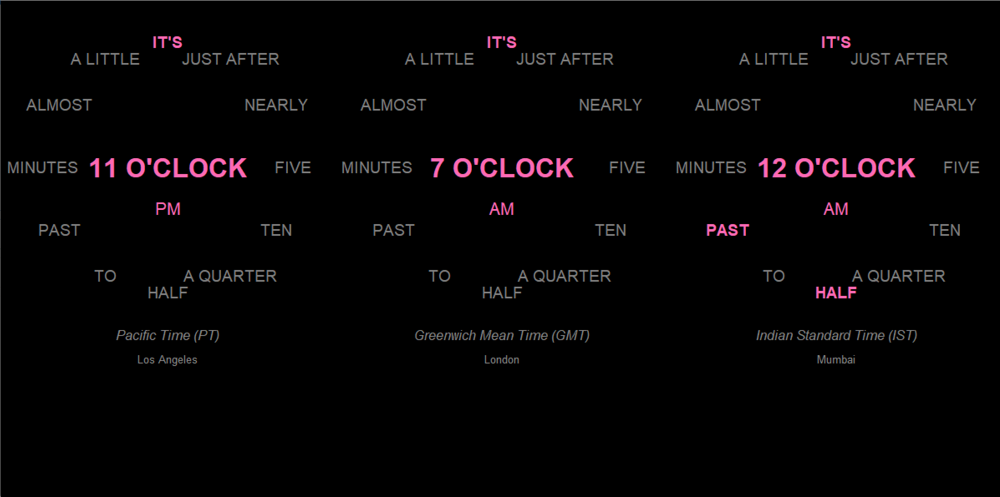

# Word Clock with Time Zone Support

## What is this?

This project is a **Word Clock**, a unique visualization of time that describes the current moment using phrases instead of digits. It comes in two flavors:

- Simple clock with no time zone support (`wordclock.py`) or
- 3 clocks with different time zones (`wordclock_zones.py`)

It supports **three time zones**—Pacific Time (PT), Greenwich Mean Time (GMT), and Indian Standard Time (IST). The clock dynamically updates and displays the current time in words, arranged in a circular layout.



### Features

- Displays time in words, arranged around a circle for each time zone
- Updates every second to reflect the current time across time zones
- Custom Time Zone Handling
  - Includes logic for manually calculating IST as GMT +5:30
  - Special AM/PM handling for IST to resolve common misalignment issues
- Prints real-time time zone calculations to help identify issues

### How It Works

The core logic calculates the time in each time zone, formats it in words, and dynamically updates the display

#### Key Code Examples

1. **IST Time Calculation**

   ```python
   def get_ist_from_gmt(gmt_time):
       return gmt_time + timedelta(hours=5, minutes=30)
   ```

2. **AM/PM Handling (with Flip for IST)**

   ```python
   def get_am_pm(hour_24, invert=False):
       if invert:  # Flip AM/PM specifically for IST
           return "AM" if hour_24 >= 12 else "PM"
       else:
           if hour_24 == 0:  
               return "AM"
           elif hour_24 < 12:
               return "AM"
           elif hour_24 == 12:  
               return "PM"
           else:
               return "PM"
   ```

3. **Dynamic Highlighting of Time Phrases**

   ```python
   def get_highlighted_phrases(current_time):
       minute = current_time.minute
       hour_12 = current_time.hour % 12 or 12
       phrases = ["IT'S"]

       if 0 <= minute < 5:
           phrases.append(f"{hour_12} O'CLOCK")
       elif 5 <= minute < 10:
           phrases.extend(["FIVE", "PAST"])
       elif 10 <= minute < 15:
           phrases.extend(["TEN", "PAST"])
       elif 15 <= minute < 20:
           phrases.extend(["A QUARTER", "PAST"])
       elif 20 <= minute < 25:
           phrases.extend(["TWENTY", "PAST"])
       elif 25 <= minute < 30:
           phrases.extend(["TWENTY", "FIVE", "PAST"])
       elif 30 <= minute < 35:
           phrases.extend(["HALF", "PAST"])
       elif 35 <= minute < 40:
           next_hour = (hour_12 + 1) % 12 or 12
           phrases.extend(["TWENTY", "FIVE", "TO", f"{next_hour}"])
       elif 40 <= minute < 45:
           next_hour = (hour_12 + 1) % 12 or 12
           phrases.extend(["TWENTY", "TO", f"{next_hour}"])
       elif 45 <= minute < 50:
           next_hour = (hour_12 + 1) % 12 or 12
           phrases.extend(["A QUARTER", "TO", f"{next_hour}"])
       elif 50 <= minute < 55:
           next_hour = (hour_12 + 1) % 12 or 12
           phrases.extend(["TEN", "TO", f"{next_hour}"])
       elif 55 <= minute < 60:
           next_hour = (hour_12 + 1) % 12 or 12
           phrases.extend(["FIVE", "TO", f"{next_hour}"])

       return phrases
   ```

4. **GUI Setup**
   
   ```python
   def create_clock(x_center, y_center, time_title, city):
       labels = []
       for phrase, angle in [
           ("IT'S", 0), ("JUST AFTER", 30), ("NEARLY", 60),
           ("FIVE", 90), ("TEN", 120), ("A QUARTER", 150),
           ("HALF", 180), ("TO", 210), ("PAST", 240),
           ("MINUTES", 270), ("ALMOST", 300), ("A LITTLE", 330)
       ]:
           x = x_center + 150 * math.cos(math.radians(angle - 90))
           y = y_center + 150 * math.sin(math.radians(angle - 90))
           label = canvas.create_text(
               x, y,
               text=phrase,
               font=("Helvetica", 14),
               fill="gray"
           )
           labels.append((label, phrase))

       hour_label = canvas.create_text(x_center, y_center, text="", font=("Helvetica", 24, "bold"), fill="#ff69b4")
       am_pm_label = canvas.create_text(x_center, y_center + 50, text="", font=("Helvetica", 16), fill="#ff69b4")
       time_zone_label = canvas.create_text(x_center, y_center + 200, text=time_title, font=("Helvetica", 12, "italic"), fill="#888888")
       city_label = canvas.create_text(x_center, y_center + 230, text=city, font=("Helvetica", 10), fill="#888888")

       return labels, hour_label, am_pm_label
   ```

### Challenges that almost drove me nuts

- Handling IST as GMT +5:30 proved tricky because of subtle differences in how Python calculates offsets
- Determining which phrases to highlight based on minute ranges
- Testing the clock across PT, GMT, and IST involved both real-time debugging and adjustments for edge cases like midnight.

### How to Run

1. Install the required dependencies:

   ```bash
   pip install pytz
   ```

2. Save the script (`word_clock.py`) and run it:

   ```bash
   python word_clock.py
   ```

3. Enjoy ✨

### **Contributing**

Feel free to fork this repository, submit issues, or propose new features.

